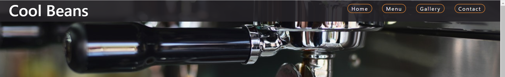
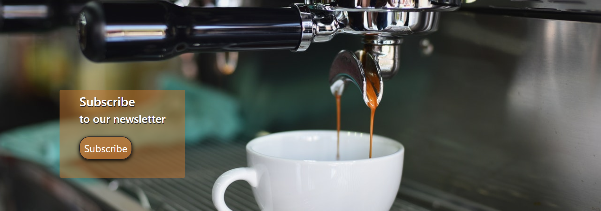
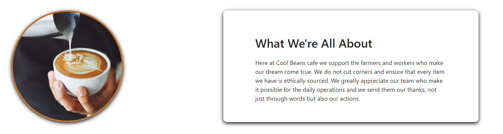
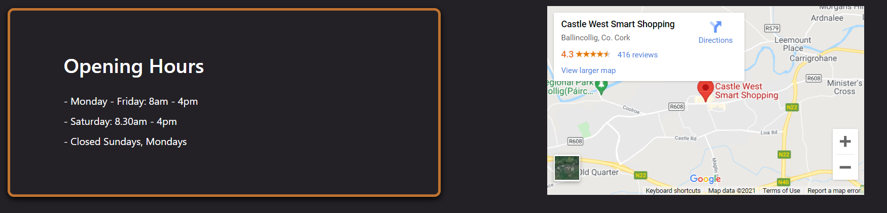
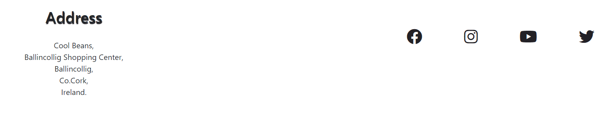

<h1>Cool Beans</h1>

Developer: Devan Hayes

Image of responsive design</img>
<h2>Table of Contents</h2>
<ol>
    <ol>
        <li></il>
        <li></il>
    </ol>
    <ol>
        <li></il>
        <li></il>
    </ol>
    <ol>
        <li></il>
        <li></il>
    </ol>
</ol>
<h2>Project Goals</h2>

<h2>Features</h2>

<h3>Navigation Bar</h3>
<ul>
    <li>
        The navigation bar allows the user the easily navigate their way through the website instinctively.
    </li>
    <li>
        The navigation bar consists of four different links to pages and the logo which is a link for the home page. These pages are Home, Menu, Gallery and Contact.
    </li>
    <li>
        This is a responsive design which changes from standard desktop navigation links that are arranged across the top of the page, to the dropdown menu for smaller screens such as mobile and tablet.
    </li>
</ul>

<h3>Landing Page Image and Subscribe Button</h3>
<ul>
    <li>
        The landing page image is an upclose photograph of coffee being poured through a portafilter into a cup which gives a clear indication of business.
    </li>
    <li>
        An overlay container with text and a button to instantly prompt the user to subscribe to the newsletter.
    </li>
</ul>

<h3>Homepage Statement</h3>
<ul>
    <li>
        This is a short statement letting the user know the company's intentions from a fairtrade standpoint.
    </li>
</ul>

<h3>Opening Hours and Map</h3>
<ul>
    <li>
        This feature gives the user information on the opening hours and the location of the gallery.
    </li>
    <li>
        The map is an interactive google map and can be used fully on the site or clicked on to enlarge the map in a different tab. 
    </li>
</ul>

<h3>Footer</h3>
<ul>
    <li>
        The information and features of the footer are seen across every page of the website.
    </li>
    <li>
        For the user's information, the address of the Cafe is on the left of the footer.
    </li>
    <li>
        On the right of the footer the user can find four social media icons which link to the cafe's social media pages, this is great for exposure to the user.
    </li>
    <li>
        The social media icons change colour and increase in size when the user hovers over the icons.
    </li>
</ul>

<h3>Menu</h3>
<ul>
    <li>
        The menu provides the user with the information of the items available for sale.
    </li>
    <li>
        This is also useful to the user for up to date pricing of the items.
    </li>
</ul>

