# Cool Beans
(Developer: Devan Hayes)
![Image of responsive design][image]

[Live website](https://rovan89.github.io/CI_PP1_Cool_Beans/)

## Table of Contents
1. Page Layout
    1. Home Page
    2. Menu 
    3. Gallery
    4. Newsletter
2. Features
    1. Navigation Bar
    2. Landing Page Image and Subscribe Button
    3. Homepage Statement
    4. Opening Hours and Map
    5. Footer
    6. Menu
    7. Ethically Sourced
    8. Hero image gallery page
    9. Gallery
    10. Newsletter Subscription
3. Design
    1. Fonts
    2. Colour Scheme
4. Wire Frames
    1. Home Page
    2. Menu
    3. Gallery
    4. Newsletter
5. Technologies Used
    1. Languages
    2. Frameworks and Tools
6. Validation
    1. HTML
        1. Home Page
        2. Menu
        3. Gallery
        4. Newsletter
    2. CSS
        1. Home Page
        2. Menu
        3. Gallery
        4. Newsletter
    3. Accessibilty
        1. Home Page
        2. Menu
        3. Gallery
        4. Newsletter
    4. Performance
        1. Home Page
        2. Menu
        3. Gallery
        4. Newsletter
7. Deployment
8. Credits
    1. Content
    2. Media

### Page Layout
#### Home Page
The home page is designed to give the user a clear understanding of what this business is, where it is located and when the user can visit the cafe. It is intuitive and easy to navigate. 

#### Menu Page
The design of the menu page was to keep it simple and in a table format. I used an image of black and white bricks as the background and had the menu in a table with an overlay effect. It is clear, straightforward and easy to read. Below the menu there is a section on fairtrade, this consists of a video on fair trade coffee faring and a block of text to back it up.

#### Gallery
The images in the gallery page are selected to showcase the options on the menu, convey the vibe of the cafe and to attract the intended customer demographic.

#### Newsletter
The intention of the newsletter is to capture customers details and develop a direct line of contact. This enables the owner to target this specific demographic and generate more revenue. 

## Features

### Navigation Bar

* The navigation bar allows the user the easily navigate their way through the website instinctively.
* The navigation bar consists of four different links to pages and the logo which is a link for the home page. These pages are Home, Menu, Gallery and Contact.git  
* This is a responsive design which changes from standard desktop navigation links that are arranged across the top of the page, to the dropdown menu for smaller screens such as mobile and tablet.

### Landing Page Image and Subscribe Button

* The landing page image is an upclose photograph of coffee being poured through a portafilter into a cup which gives a clear indication of business.
* An overlay container with text and a button to instantly prompt the user to subscribe to the newsletter.

### Homepage Statement

* This is a short statement letting the user know the company's intentions from a fairtrade standpoint.

### Opening Hours and Map

* This feature gives the user information on the opening hours and the location of the gallery.

* The map is an interactive google map and can be used fully on the site or clicked on to enlarge the map in a different tab. 

### Footer

* The information and features of the footer are seen across every page of the website.

* For the user's information, the address of the Cafe is on the left of the footer.

* On the right of the footer the user can find four social media icons which link to the cafe's social media pages, this is great for exposure to the user.

* The social media icons change colour and increase in size when the user hovers over the icons.

### Menu

* The menu provides the user with the information of the items available for sale.

* This is also useful to the user for up to date pricing of the items.

### Ethically Sourced

* This is to strengthen the Cool Beans ethos in the user's mind.

* This section provides the user with information on fairtrade

* The video is a short case study on coffee farmers.

* The text section includes the Cool Beans view and also contains a link for the user to discover more on this subject.

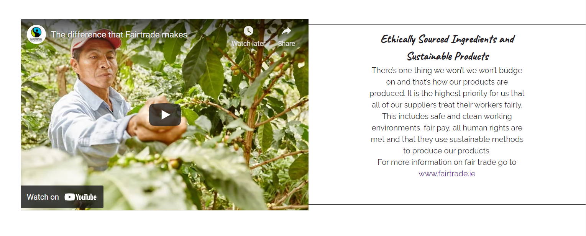

### Hero image gallery page

* The hero image gives the user a sense of the who the owners are.

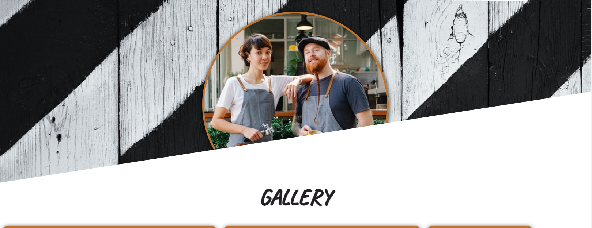

### Gallery

* Having a gallery allows the user to envision themselves in the restaurant.

* The gallery is useful to users to show what they can expect from the cafe.

* This allows the owner to put forward their best work and direct the user to the main points of focus for the business. 

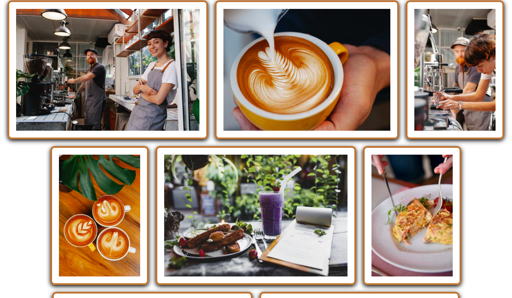

### Newsletter Subscription

* The newsletter provides the user with information of offers, exclusives and the goings on of the cafe.

* This section is extremely valuable to the site owner as it creates a new direct line of contact with the user.

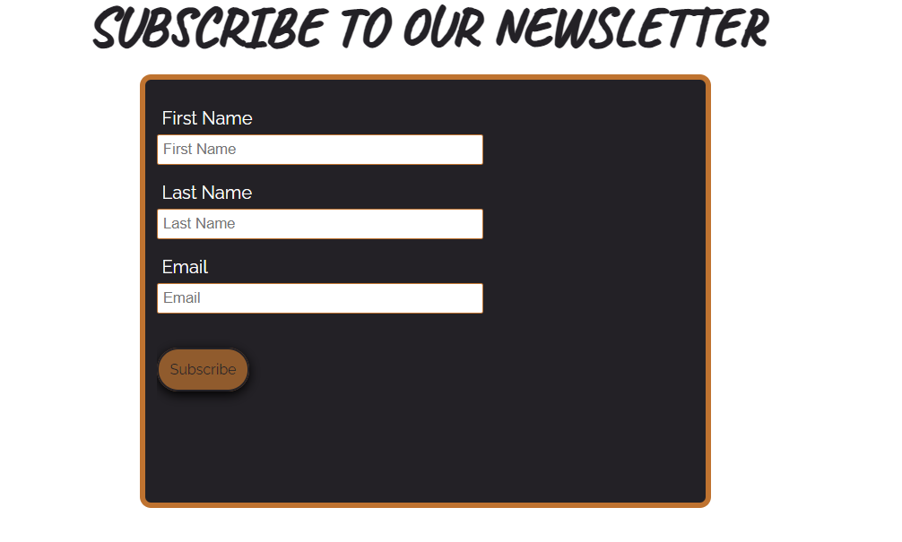

## Design

### Fonts

* Raleway

* Caveat

### Colour Scheme

To keep in theme, the colour scheme is based on cafe photos provided, such as a light brown extracted from an image of coffee, white taken from the colour of the cups and the dark grey chosen from a number of items in the cafe revolving around this color. 

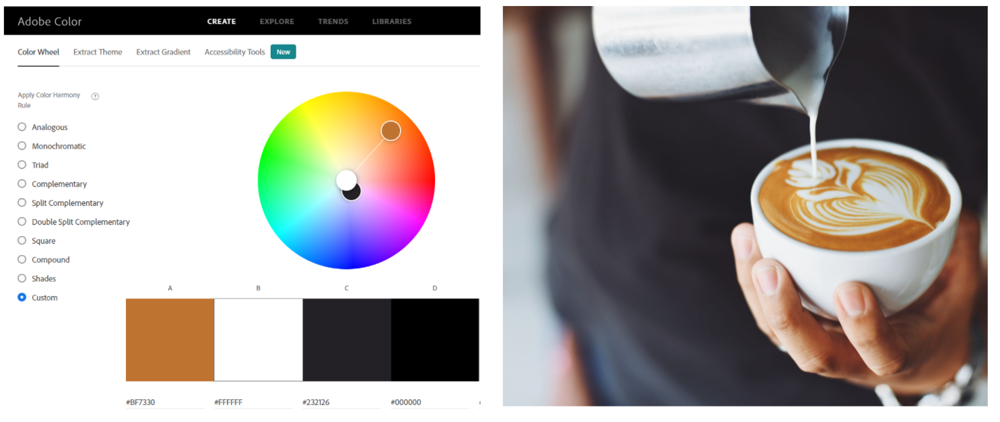

## Wire Frames
### Home Page
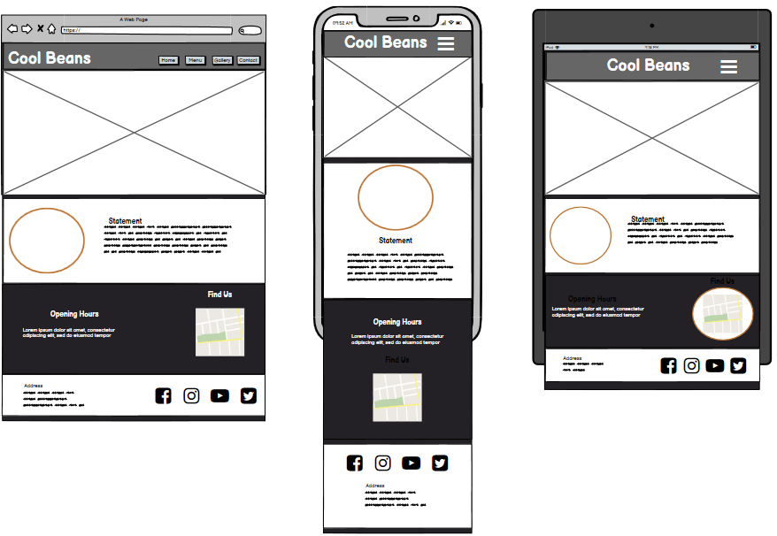

### Menu Page
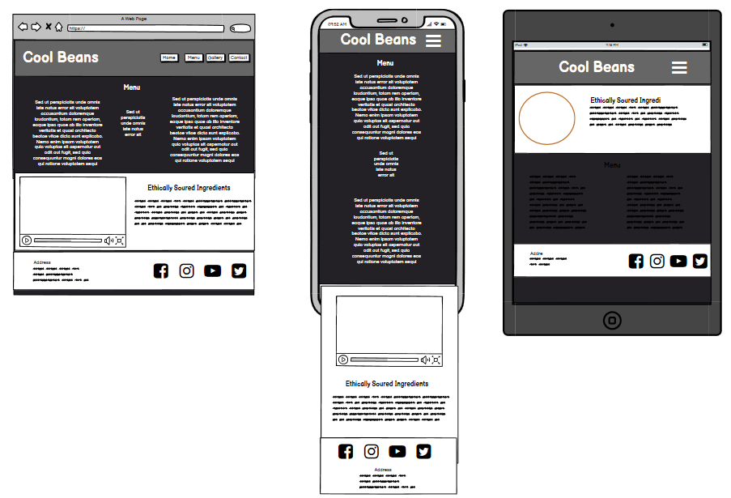

### Gallery Page
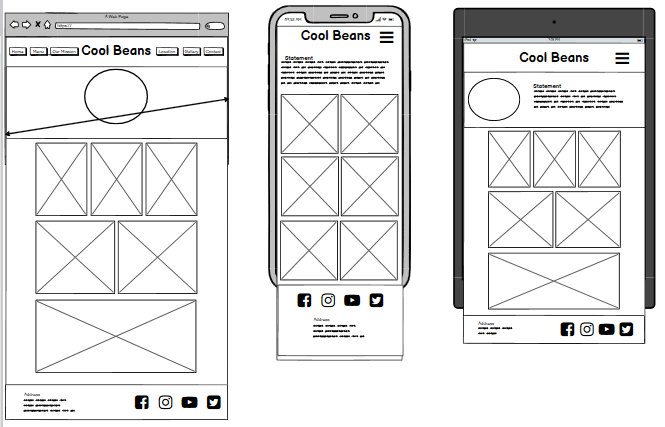

### Newsletter Page
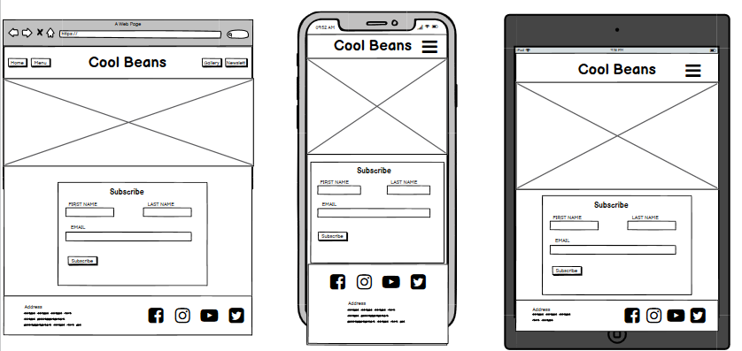

## Technologies Used 
* HTML 
* CSS 

### Frameworks and Tools
* Balsamiq
* Adobe Colour
* Google Fonts
* Github 
* Gitpod
* Fontawesome
* Favicon 

## Validation 

### HTML
W3C Markup Validation was used to validate the HTML for the Cool Beans website. No errors or warnings

#### Home
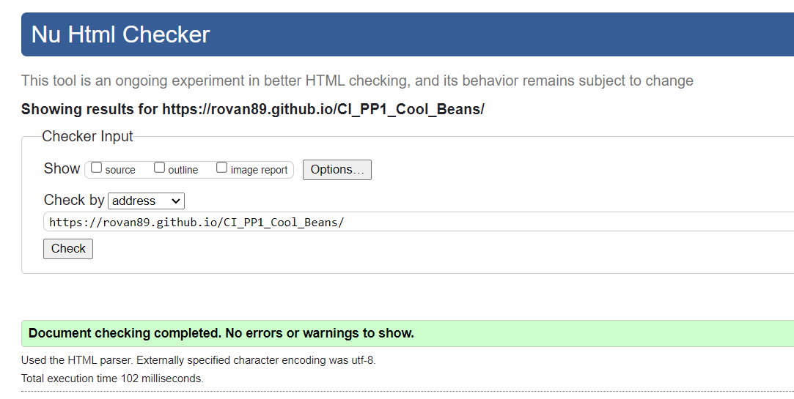

#### Menu 
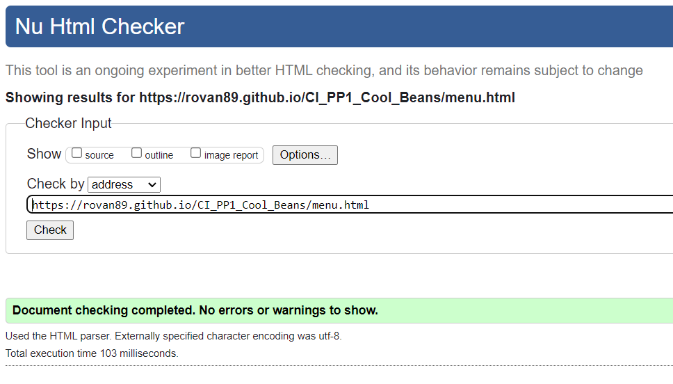

#### Gallery
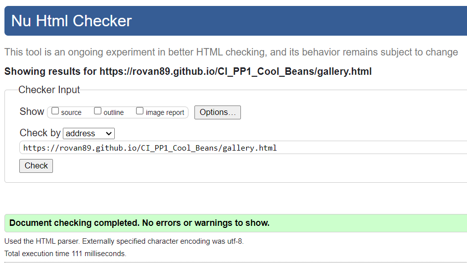

#### Newsletter 
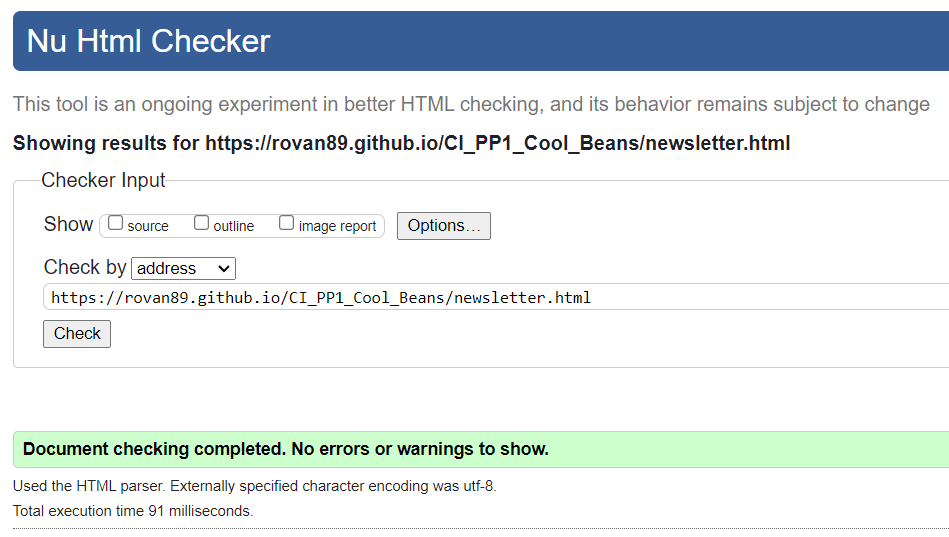

### CSS 

#### Home
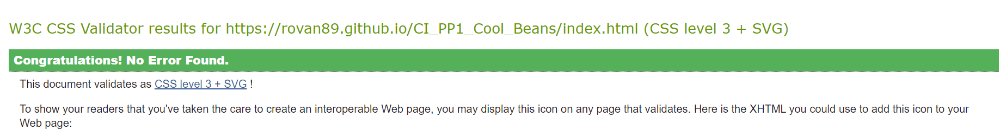

#### Menu
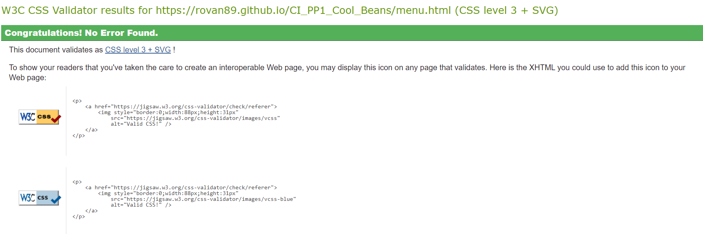

#### Gallery
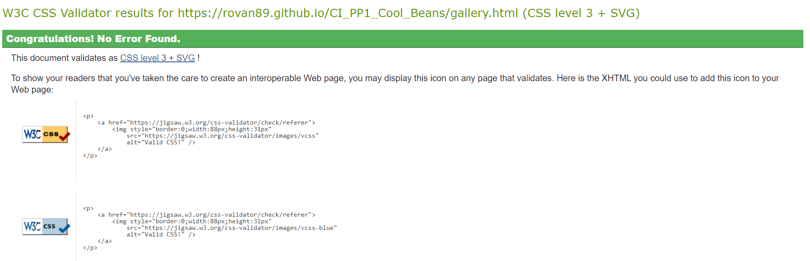

#### Newsletter

### Accessibilty

#### Home
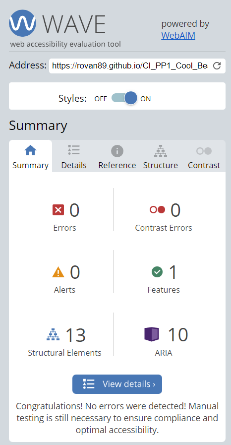

#### Menu
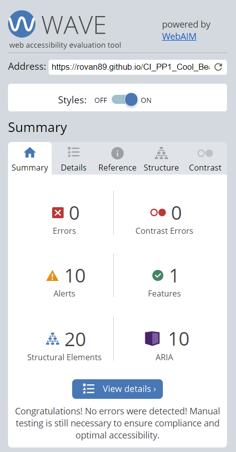

#### Gallery
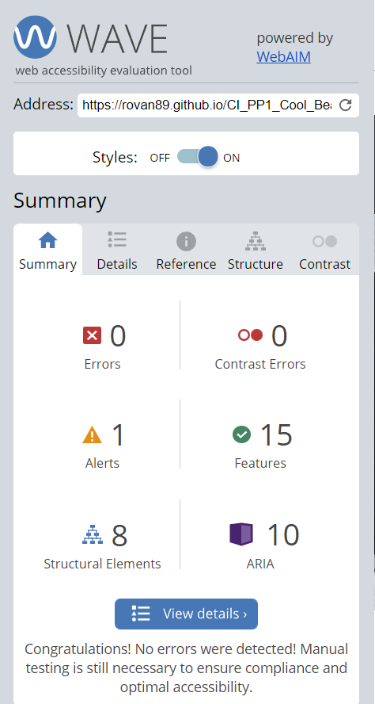

#### Newsletter
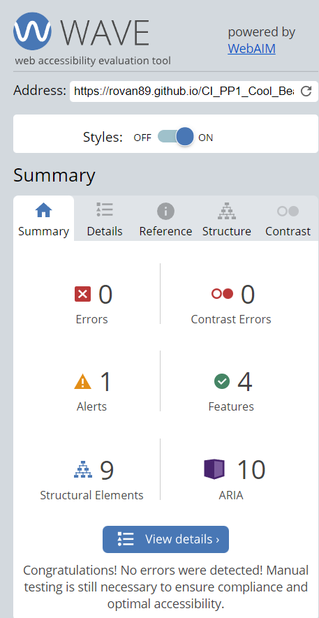

### Performance

#### Home
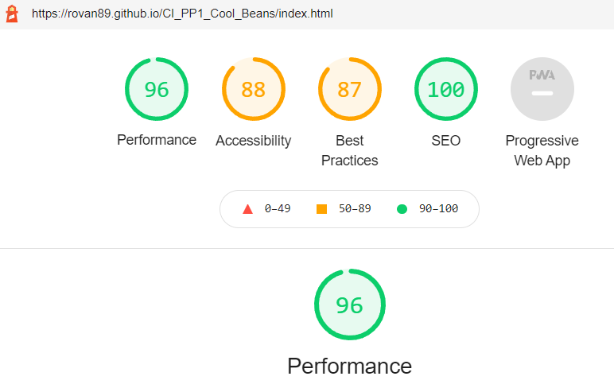

#### Menu
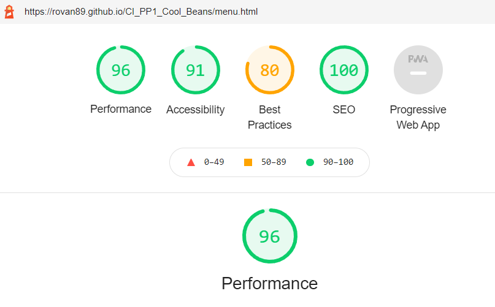

#### Gallery
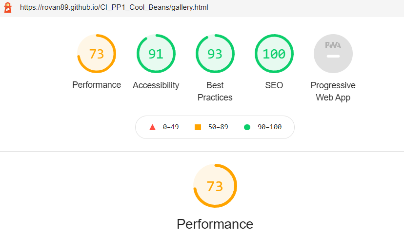

#### Newsletter
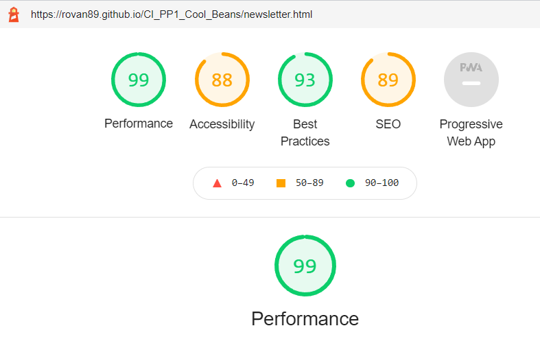

## Deployment
* To deploy this site GitHub was the chosen hosting platform
    -The steps I took to deploy this site are as follows
        - In the GitHub repository, navigate to settings
        - On the left side of the page navigate to pages
        - Under the source section navigate to branch tab and choose Branch: Main

[Live website](https://rovan89.github.io/CI_PP1_Cool_Beans/)

## Credits 

### Content
* The responsive hamburger navigation bar was taken from https://getbootstrap.com/docs/4.0/components/navbar/#responsive-behaviors 
* The icons used were taken from fontawesome.com
* The favicon was taken from https://favicon.io/ 

### Media 

* All picture were taken form https://www.pexels.com/"
    - Photo by Anna Urlapova from Pexels
        - https://www.pexels.com/@urlapovaanna?utm_content=attributionCopyText&utm_medium=referral&utm_source=pexels 
    - Photo by Chevanon Photography from Pexels
        - https://www.pexels.com/photo/person-performing-coffee-art-302899/
    - Photo by Michael Burrows from Pexels
        - https://www.pexels.com/photo/crop-unrecognizable-man-showing-ripe-coffee-berries-on-hand-7125420/ 
    - Photo by Tim Douglas from Pexels
        - https://www.pexels.com/photo/happy-woman-baristas-working-in-modern-cafe-kitchen-6205626/
    - Photo by Live on Shot from Pexels 
        - https://www.pexels.com/photo/people-in-cafe-2788792/
    - Photo by Tim Douglas from Pexels
        - https://www.pexels.com/photo/happy-woman-showing-wooden-signboard-saying-open-6205759/
    - Photo by ROMAN ODINTSOV from Pexels
        - https://www.pexels.com/photo/fresh-blueberry-smoothie-and-spanish-churros-near-menu-in-cafeteria-4551414/
    - Photo by Anna Tis from Pexels
        - https://www.pexels.com/photo/sliced-pizza-on-white-ceramic-plate-9275985/
    - Photo by jf valeriano from Pexels
        - https://www.pexels.com/photo/bread-with-green-vegetable-on-white-paper-3609894/
    - Photo by Frans Van Heerden from Pexels
        - https://www.pexels.com/photo/grayscale-photo-of-brickwall-1022692/
    - Photo by Ella Olsson from Pexels
        - https://www.pexels.com/photo/photo-of-vegetable-salad-in-bowls-1640770/
    - Photo by Nataliya Vaitkevich from Pexels
        - https://www.pexels.com/photo/white-ceramic-bowl-with-soup-and-brown-wooden-chopsticks-5605555/
    - Photo by RODNAE Productions from Pexels
        - https://www.pexels.com/photo/red-and-orange-soup-in-a-bowl-on-the-wooden-table-top-5737247/
    - Photo by Fallon Michael from Pexels
        - https://www.pexels.com/photo/cup-of-brown-coffee-3551717/

